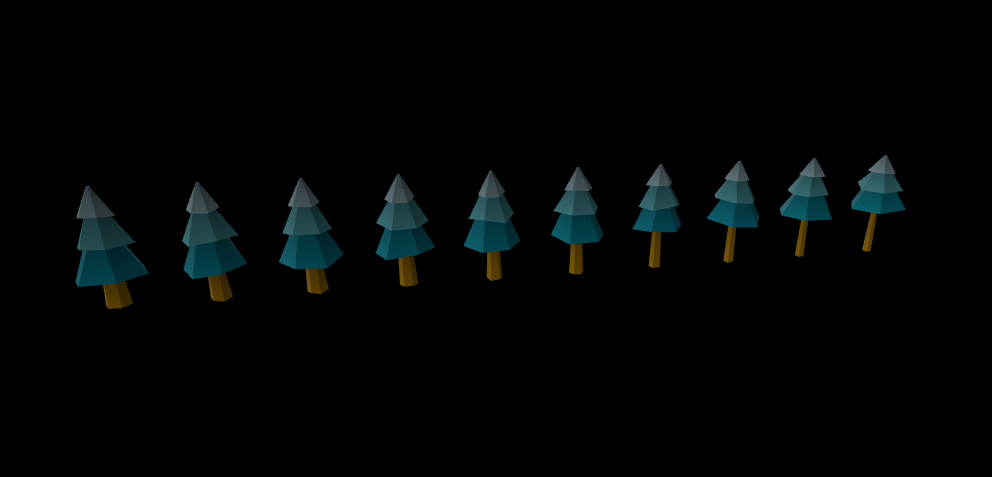
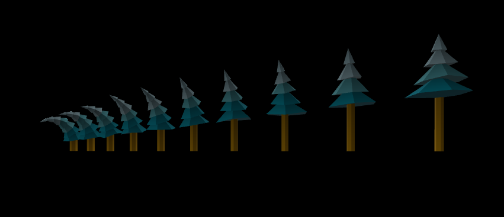
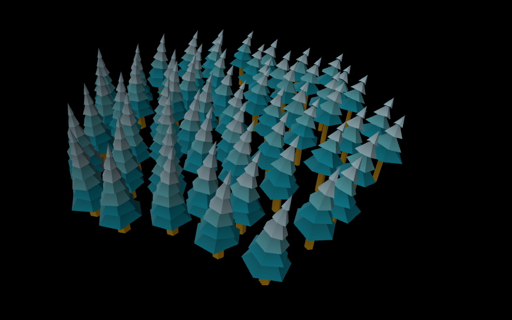
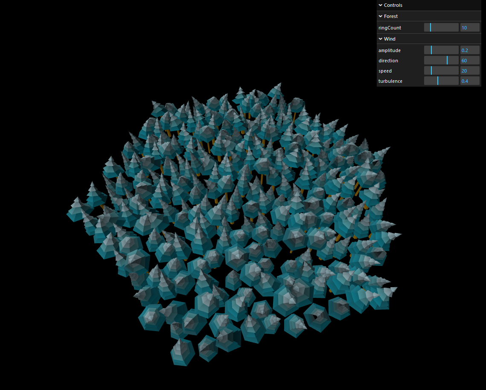

PolyworldJS
===========

This is a ThreeJS reboot of the [Polyworld](https://polyworld.exppad.com/) Blender add-on, that intends to ue instancing as much as possible to enable real-time variations of entire forests.

License
-------

<!--[PolyworldJS](https://github.com/eliemichel/PolyworldJS) © 2024 by [Élie Michel](https://www.exppad.com/) is licensed under [CC BY 4.0 ](http://creativecommons.org/licenses/by/4.0/?ref=chooser-v1)-->

<a href="https://github.com/eliemichel/PolyworldJS">PolyworldJS</a> © 2024 by <a href="https://www.exppad.com">Élie Michel</a> is licensed under <a href="http://creativecommons.org/licenses/by/4.0/?ref=chooser-v1">CC BY 4.0 </a>
